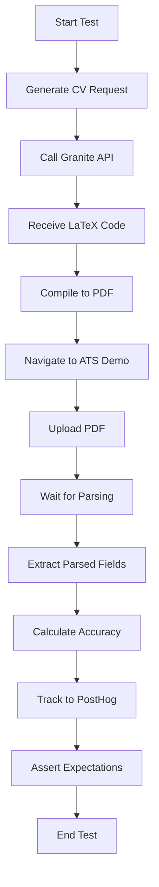

# ATS CV Testing Research - Playwright Test Suite

Automated end-to-end tests for evaluating CV parsing accuracy across 15 major Applicant Tracking Systems (ATS).

## Overview

This test suite automates the process of:
1. **Generating CVs** using IBM Granite LLM (via OpenAI-compatible API)
2. **Compiling to PDF** using LaTeX or PDFKit fallback
3. **Uploading to ATS demo sites** for each of the 15 systems
4. **Verifying parsing accuracy** by comparing extracted fields
5. **Tracking results** to PostHog for analytics

## Test Coverage

### 15 ATS Systems Tested

**Tier 1 (Market Leaders):**
- Workday (15.3% market share)
- Greenhouse (13.2%)
- iCIMS (10.7%)
- Oracle Taleo (6.4%)
- Lever (3.9%)

**Tier 2 (Regional & Specialized):**
- SAP SuccessFactors (8.5%)
- UKG (4.8%)
- Zoho Recruit (3.1%)
- SmartRecruiters (2.5%)
- SEEK Talent (2.3%)
- Teamtailor (2.1%)
- JazzHR (1.9%)
- Personio (1.8%)
- PageUp (1.6%)
- Recruitee (1.4%)

### Two CV Formats Tested per ATS

Each system is tested with both:
- **Table Format**: Uses LaTeX `tabular` environment for experience/education
- **List Format**: Uses `itemize`/`description` environments with bullet points

This results in **30 total test cases** (15 ATS × 2 formats).

## Architecture

```
tests/
├── ats/                         # Test files (15 ATS systems)
│   ├── workday.spec.ts
│   ├── greenhouse.spec.ts
│   ├── icims.spec.ts
│   └── ... (12 more)
├── fixtures/
│   ├── cv-generator.ts          # Granite API client for CV generation
│   └── latex-compiler.ts        # LaTeX→PDF compilation (pdflatex/PDFKit)
├── utils/
│   └── posthog-tracker.ts       # PostHog analytics tracking
├── playwright.config.ts         # Playwright configuration
├── tsconfig.json               # TypeScript configuration
├── package.json                # Dependencies
└── README.md                   # This file
```

## Prerequisites

### Required

- **Node.js** 18+ (LTS recommended)
- **npm** or **yarn**

### Optional (for native LaTeX compilation)

- **pdflatex** (from TeX Live or MiKTeX)
  - Tests will automatically fall back to PDFKit if LaTeX is unavailable

### Environment Variables

Create a `.env` file in the `tests/` directory:

```env
# Granite API (required for CV generation)
GRANITE_API_KEY=your_granite_api_key
GRANITE_API_URL=https://api.granite.ai/v1
GRANITE_MODEL=granite-3-8b-instruct

# PostHog Analytics (optional but recommended)
POSTHOG_API_KEY=your_posthog_api_key
POSTHOG_HOST=https://app.posthog.com
POSTHOG_DISTINCT_ID=ats-test-runner

# Test Configuration
CI=false                         # Set to 'true' in CI environments
BASE_URL=http://localhost:3000   # Base URL for local testing (if applicable)
```

## Installation

```bash
cd tests/
npm install
npx playwright install
```

## Running Tests

### Run All Tests

```bash
npm test
```

### Run Specific ATS

```bash
npx playwright test ats/workday.spec.ts
npx playwright test ats/greenhouse.spec.ts
```

### Run Specific Format

```bash
npx playwright test -g "table format"
npx playwright test -g "list format"
```

### Run with UI Mode (Interactive)

```bash
npm run test:ui
```

### Run in Headed Mode (See Browser)

```bash
npm run test:headed
```

### Debug Mode (Step-by-step)

```bash
npm run test:debug
```

### Run on Specific Browser

```bash
npx playwright test --project=chromium
npx playwright test --project=firefox
npx playwright test --project=webkit
```

## Test Flow

Each test follows this standardized flow:



### Detailed Steps

1. **CV Generation**
   - Creates randomized but realistic candidate data
   - Sends to Granite API with format-specific prompt
   - Receives LaTeX code for table or list format

2. **PDF Compilation**
   - Attempts native LaTeX compilation with `pdflatex`
   - Falls back to PDFKit if LaTeX unavailable
   - Validates PDF was created successfully

3. **ATS Navigation**
   - Opens ATS demo URL in browser
   - Waits for page to fully load
   - Locates file upload input

4. **Upload & Parsing**
   - Uploads generated PDF
   - Waits 3 seconds for ATS to parse
   - ATS extracts data from PDF

5. **Verification**
   - Extracts values from form fields
   - Compares with original data
   - Calculates parsing accuracy (%)

6. **Analytics**
   - Sends results to PostHog
   - Includes accuracy, duration, errors
   - Tracks CV generation and compilation metrics

## Expected Parsing Accuracy

Based on data from `data/ats-systems.json`:

| ATS | Table Format | List Format | Grade |
|-----|--------------|-------------|-------|
| Greenhouse | 82% | 97% | A+ |
| Workday | 78% | 96% | A+ |
| Lever | 75% | 95% | A+ |
| Teamtailor | 73% | 94% | A |
| SAP SuccessFactors | 71% | 94% | A |
| Personio | 70% | 92% | A |
| SEEK Talent | 69% | 93% | A |
| SmartRecruiters | 68% | 91% | A |
| Recruitee | 66% | 91% | A |
| iCIMS | 65% | 92% | A |
| PageUp | 64% | 90% | A- |
| UKG | 61% | 89% | B+ |
| JazzHR | 58% | 87% | B+ |
| Zoho Recruit | 54% | 88% | B+ |
| Oracle Taleo | 52% | 85% | B |

**Key Insight**: List format consistently outperforms table format across all systems.

## Configuration

### Playwright Settings (`playwright.config.ts`)

- **Parallel Execution**: 3 workers (1 in CI)
- **Retries**: 1 local, 2 in CI
- **Timeout**: 180 seconds per test
- **Browsers**: Chromium, Firefox, WebKit, Mobile (Chrome & Safari)
- **Reporters**: HTML, JSON, JUnit, List

### TypeScript Settings (`tsconfig.json`)

- **Strict Mode**: Enabled
- **Target**: ES2022
- **Module**: ES2022
- **Type Checking**: Comprehensive (noUnusedLocals, noImplicitReturns, etc.)

## Custom Fixtures

### CVGenerator (`fixtures/cv-generator.ts`)

OpenAI-compatible client for Granite API:

```typescript
const generator = createCVGenerator({
  apiKey: 'your_key',
  baseURL: 'https://api.granite.ai/v1',
  model: 'granite-3-8b-instruct'
});

const cvResponse = await generator.generateCV({
  name: 'John Smith',
  email: 'john@example.com',
  phone: '+1 555-0123',
  experience: [...],
  education: [...],
  skills: ['Python', 'JavaScript'],
  format: 'table' // or 'list'
});
```

### LaTeXCompiler (`fixtures/latex-compiler.ts`)

Compiles LaTeX to PDF with fallback:

```typescript
const compiler = createLaTeXCompiler({ preferPDFKit: false });

const result = await compiler.compile(
  latexCode,
  'output-name',
  { engine: 'pdflatex', cleanup: true }
);

if (result.success) {
  console.log('PDF created:', result.pdfPath);
  console.log('Buffer:', result.pdfBuffer);
}
```

### PostHogTracker (`utils/posthog-tracker.ts`)

Analytics tracking:

```typescript
const tracker = createPostHogTracker({
  apiKey: 'your_key',
  host: 'https://app.posthog.com'
});

await tracker.trackATSTest({
  atsName: 'Workday',
  format: 'table',
  success: true,
  parsingAccuracy: 85.5,
  fieldsParsed: { email: true, phone: true },
  duration: 15000
}, {
  testId: 'test-123',
  timestamp: new Date().toISOString(),
  browser: 'chromium',
  environment: 'ci'
});
```

## Troubleshooting

### Tests Timing Out

**Problem**: Tests exceed 180-second timeout

**Solutions**:
- Increase timeout in `playwright.config.ts`
- Check network connectivity
- Verify ATS demo sites are accessible
- Use `--workers=1` to run sequentially

### LaTeX Compilation Failing

**Problem**: PDF generation fails with LaTeX errors

**Solutions**:
- Install TeX Live: `sudo apt-get install texlive-full` (Linux)
- Or use PDFKit fallback: `preferPDFKit: true` in config
- Check LaTeX syntax in generated code

### Granite API Errors

**Problem**: CV generation returns 401/429 errors

**Solutions**:
- Verify `GRANITE_API_KEY` is set correctly
- Check API quota/rate limits
- Ensure API endpoint is correct
- Test connectivity: `curl https://api.granite.ai/v1/models`

### PostHog Not Tracking

**Problem**: Events not appearing in PostHog

**Solutions**:
- Verify `POSTHOG_API_KEY` is set
- Check PostHog host URL
- Ensure `tracker.flush()` is called
- Set `enabled: true` explicitly

### Parsing Accuracy Lower Than Expected

**Problem**: Accuracy below threshold in `ats-systems.json`

**Possible Causes**:
- ATS website structure changed (update selectors)
- PDF quality issues (check LaTeX output)
- Timing issues (increase wait after upload)
- Font rendering problems (try different fonts in LaTeX)

## CI/CD Integration

### GitHub Actions Example

```yaml
name: ATS Tests

on: [push, pull_request]

jobs:
  test:
    runs-on: ubuntu-latest
    steps:
      - uses: actions/checkout@v3
      
      - name: Setup Node.js
        uses: actions/setup-node@v3
        with:
          node-version: '18'
      
      - name: Install dependencies
        working-directory: tests
        run: |
          npm ci
          npx playwright install --with-deps
      
      - name: Run tests
        working-directory: tests
        env:
          GRANITE_API_KEY: ${{ secrets.GRANITE_API_KEY }}
          POSTHOG_API_KEY: ${{ secrets.POSTHOG_API_KEY }}
          CI: true
        run: npm test
      
      - name: Upload test results
        if: always()
        uses: actions/upload-artifact@v3
        with:
          name: playwright-report
          path: tests/playwright-report/
```

## Best Practices

1. **Use Seed Values**: Generate deterministic test data for reproducibility
2. **Screenshot on Failure**: Enabled by default in config
3. **Video Recording**: Captured on failure for debugging
4. **Trace Files**: Available on first retry for deep debugging
5. **Parallel Execution**: Speeds up test runs significantly
6. **Idempotent Tests**: Each test is independent and can run in any order
7. **Timeout Management**: Conservative timeouts account for network variability

## Performance Benchmarks

Average test duration per ATS (local machine):

- **CV Generation**: 2-5 seconds
- **PDF Compilation**: 1-3 seconds (PDFKit) or 3-8 seconds (pdflatex)
- **Page Navigation**: 2-5 seconds
- **Upload & Parsing**: 3-5 seconds
- **Verification**: 1-2 seconds
- **Total**: ~10-30 seconds per test

Full suite (30 tests, 3 workers): ~5-10 minutes

## Analytics Dashboard

View results in PostHog:

1. **Parsing Accuracy by ATS**: Bar chart comparing all systems
2. **Table vs List Performance**: Format comparison
3. **Success Rate Over Time**: Trend analysis
4. **Average Duration**: Performance metrics
5. **Field-Level Accuracy**: Heatmap of firstName, email, phone, etc.

## Contributing

When adding a new ATS:

1. Add system data to `data/ats-systems.json`
2. Create test file: `ats/{system-name}.spec.ts`
3. Copy template from `workday.spec.ts`
4. Update system name and selectors
5. Run test to verify: `npx playwright test ats/{system-name}.spec.ts`
6. Update this README with new system

## License

MIT License - See LICENSE file in repository root

## Support

- **Issues**: Open on GitHub repository
- **Discussions**: Use GitHub Discussions
- **Documentation**: See `/docs` folder in repository root

## References

- [Playwright Documentation](https://playwright.dev/)
- [IBM Granite Models](https://www.ibm.com/granite)
- [PostHog Analytics](https://posthog.com/)
- [LaTeX Documentation](https://www.latex-project.org/)
- [ATS Market Research](../docs/market-research.md)
